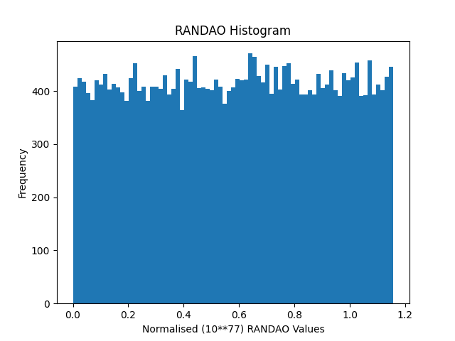

# Empirical RANDAO Distribution

Empirical distribution of the randomness beacon (=RANDAO) provided by the Beacon chain. The first Proof-of-Stake (PoS) block number is [`15537394`](https://etherscan.io/block/15537394). Beginning with `15537394`, every Beacon node sets the value of the `mixHash`, i.e. the field with the number 13 (0-indexed) in a block header, to the latest RANDAO mix of the post beacon state of the previous block. The probability of the RANDAO value to fall into the range between `0` and `2**64` is drastically low*. For more details, I refer to [EIP-4399](https://eips.ethereum.org/EIPS/eip-4399).

* The probability of `RANDAO > 2**64` is $1-\left(\frac{1}{2}\right)^{192}$ = 0.9999999999999999999999999999999999999999999999999999999998406908088867547722971119602232288194408895444807381213926114146613837099. 

## Visualisation from `blockNumber=15537394` to `blockNumber=15568555`

  

